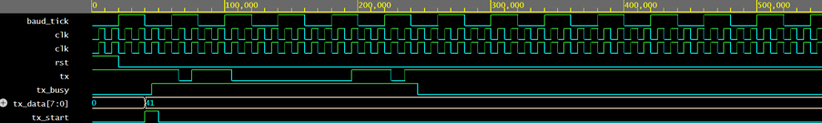
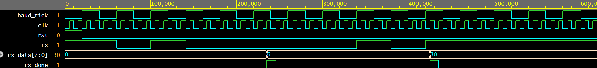

# UART Implementation in Verilog

## Overview
This project implements a basic UART (Universal Asynchronous Receiver Transmitter) using Verilog HDL.

## Features
- Baud Rate Generator
- UART Transmitter (8-bit, 1 Start, 1 Stop)
- UART Receiver
- Top-Level UART Integration
- Individual Testbenches
- Loopback Verification

## Repository Structure

```
UART-Implementation-Verilog/
├── baud_rate_generator.v
├── uart_tx.v
├── uart_rx.v
├── uart_top.v
├── uart_tx_tb.v
├── uart_rx_tb.v
└── uart_top_tb.v
```

## Tools Used
- Verilog HDL
- EDA Playground
- GitHub

## Future Improvements
- Parity Bit Support
- 16× Oversampling

- ## Simulation Results

### UART Transmitter Waveform


### UART Receiver Waveform

- FIFO Buffer
- FPGA Implementation
